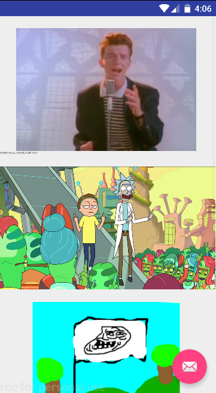
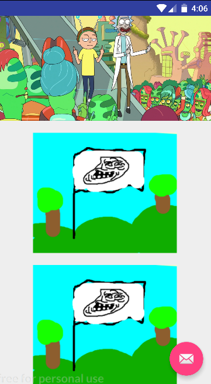
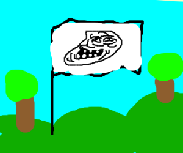
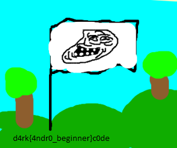

# Forensics <br> 30

> Somebody replaced the flag with a troll one.
>
> Find the real flag.
>
> [crackme.apk](./../crackme.apk)

After Installing and on starting we get this on the screen.




I decompiled the app using [apktool](https://ibotpeaches.github.io/Apktool). you can use [apkstudio](https://github.com/vaibhavpandeyvpz/apkstudio) too.

We had to find the real flag. When I was solving the Look Challenge I was checking the drawable folder and found these images which helped me in solving this level.







we see an interesting png here named ```real_flag.png```.

flag = <b>d4rk{4ndr0_beginner}c0de


