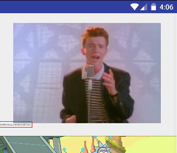

# Look</br>   20

> Look Closely
>
> [crackme.apk](./../crackme.apk)

After Installing and on starting we get this on the screen.


Well they asked to look closely and so I did. 



This gave me an idea to check the activity_main in the layout folder.

I used [jadx](https://github.com/skylot/jadx) for decompilation.

```java
public class MainActivity extends AppCompatActivity {
    protected void onCreate(Bundle savedInstanceState) {
        super.onCreate(savedInstanceState);
        setContentView((int) R.layout.activity_main);
        setSupportActionBar((Toolbar) findViewById(R.id.toolbar));
        ((FloatingActionButton) findViewById(R.id.fab)).setOnClickListener(new OnClickListener() {
            public void onClick(View view) {
                Snackbar.make(view, (CharSequence) "Replace with your own action", 0).setAction((CharSequence) "Action", null).show();
            }
        });
    }

    public boolean onCreateOptionsMenu(Menu menu) {
        getMenuInflater().inflate(R.menu.menu_main, menu);
        return true;
    }

    public boolean onOptionsItemSelected(MenuItem item) {
        if (item.getItemId() == R.id.action_settings) {
            return true;
        }
        return super.onOptionsItemSelected(item);
    }
}
```

I decompiled the apk to check if they are hard coding the text in TextView but I was wrong. So they must have hardcoded in activity_main.xml so let's decompile the apk using [apktool](https://ibotpeaches.github.io/Apktool). you can use [apkstudio](https://github.com/vaibhavpandeyvpz/apkstudio) too.

```xml
<?xml version="1.0" encoding="utf-8"?>
<android.support.design.widget.CoordinatorLayout android:layout_width="fill_parent" android:layout_height="fill_parent"
  xmlns:android="http://schemas.android.com/apk/res/android" xmlns:app="http://schemas.android.com/apk/res-auto">
    <ScrollView android:layout_width="fill_parent" android:layout_height="fill_parent">
        <include layout="@layout/content_main" />
    </ScrollView>
    <android.support.design.widget.FloatingActionButton android:layout_gravity="end|bottom|center" android:id="@id/fab" android:layout_width="wrap_content" android:layout_height="wrap_content" android:layout_margin="@dimen/fab_margin" app:srcCompat="@android:drawable/ic_dialog_email" />
</android.support.design.widget.CoordinatorLayout>
```
activity_main.xml includes ```xml <include layout="@layout/content_main" />```

let's check content_main.xml

```xml
<?xml version="1.0" encoding="utf-8"?>
<LinearLayout android:orientation="vertical" android:layout_width="fill_parent" android:layout_height="fill_parent" app:layout_behavior="@string/appbar_scrolling_view_behavior"
  xmlns:android="http://schemas.android.com/apk/res/android" xmlns:app="http://schemas.android.com/apk/res-auto">
    <ImageView android:layout_width="fill_parent" android:layout_height="200.0dip" android:layout_marginTop="20.0dip" android:src="@drawable/rick" />
    <TextView android:textSize="4.0sp" android:layout_width="fill_parent" android:layout_height="wrap_content" android:text="d4rk{Welcome_to_Android_World}c0de" />
    <ImageView android:id="@id/imageView" android:layout_width="fill_parent" android:layout_height="200.0dip" android:layout_marginTop="20.0dip" android:src="@drawable/morty" />
    <ImageView android:layout_width="fill_parent" android:layout_height="200.0dip" android:layout_marginTop="20.0dip" android:src="@drawable/flag" />
    <ImageView android:layout_width="fill_parent" android:layout_height="200.0dip" android:layout_marginTop="20.0dip" android:src="@drawable/flag" />
</LinearLayout>
```
in this content_main.xml we see an interesting TextView whose text is  <b>d4rk{Welcome_to_Android_World}c0de

